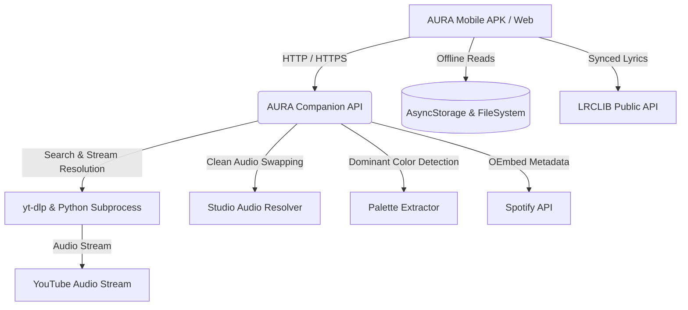

# 🎵 AURA Music Player

<div align="center">


### Premium Titanium Dark-Themed Streaming & Offline Music Player
Built with **React Native (Expo SDK 57)**, **TypeScript**, **Vanilla CSS / StyleSheet**, and an ultra-lean **Node.js & Python (`yt-dlp`)** companion extraction engine.

[](https://expo.dev)
[](https://reactnative.dev)
[](https://www.typescriptlang.org)
[](https://nodejs.org)
[](https://www.python.org)
[](https://www.docker.com)
[](LICENSE)

[Features](#-key-features) • [Architecture](#-architecture) • [Getting Started](#-getting-started) • [Cloud Deployment (Render)](#-cloud-deployment-render) • [EAS Cloud APK Build](#-building-the-apk-eas) • [API Reference](#-backend-api-reference)

</div>

---

## ✨ Key Features

### 🎧 Pure Audio Experience
- **Studio Audio Auto-Resolver**: Intelligently detects music videos with conversational skits, cinematic intros, or director cuts and automatically swaps them for the authentic studio recording.
- **Dynamic Harmonic Glow Backdrops**: Real-time color palette extraction (`Pillow` / Canvas) that dynamically tints the UI backdrop and player glows based on the current album artwork.
- **Synchronized Live Lyrics**: Real-time line-by-line synced lyrics powered by LRCLIB with offline caching for zero-data reading.
- **High-Fidelity Audio Engine**: Built on modern `expo-audio` with full background playback support and lock screen media notification controls.

### 📲 Mobile-First Polish & Gestures
- **Tactile Drag-and-Drop Queue**: Reorder your queue on the fly using smooth PanResponder vertical gesture dragging with haptic feedback.
- **Spotify-Style Sticky Floating Mini-Player**: Glassmorphic mini-player with live scrubber line, double-bezel artwork, and quick skip/play controls.
- **Horizontal Slidable Filter Pills**: Effortlessly slide between Downloaded, Favorites, and Playlists across any phone screen size.
- **Safe Area Offset Architecture**: Dynamic top notch and status bar clearing across all views (Home, Downloader, Library, and Playlist detail).
- **Custom Playlist Artworks**: Personalize playlists using device gallery photos, curated soundscapes (*Synthwave, Lofi, EDM, Acoustic*), or remote HTTPS URLs.

### 🌐 Universal Connectivity
- **Spotify Playlist Importer**: Paste any public Spotify playlist URL to instantly parse tracks and import high-res album covers via oEmbed.
- **Offline-First Zero-Data Mode**: Download tracks with 1 tap. Audio streams, metadata, and synchronized lyrics are saved directly to device storage for true airplane-mode playback.

---

## 🏛 Architecture



---

## 📂 Project Structure

```text
MusicPlayerApp/
├── assets/                     # Transcoded PNG icons, splashes, and curated soundscape covers
├── server/                     # Companion Extraction & Streaming Backend
│   ├── apiHandler.js           # Universal API routes, range streaming & cache management
│   ├── server.js               # Standalone HTTP daemon runner (port 5000)
│   ├── studioAudioResolver.py  # Skit & cinematic intro detector
│   ├── paletteExtractor.py     # Vibrant & moody harmonic palette generator
│   └── requirements.txt        # Python dependencies (yt-dlp, Pillow)
├── src/
│   ├── components/             # Reusable UI primitives
│   │   ├── AnimatedSplashScreen.tsx # Sonic ripple launch sequence
│   │   ├── AuraLogo.tsx        # High-definition titanium logo
│   │   ├── FullScreenPlayer.tsx# Full player modal with Draggable Queue & Synced Lyrics
│   │   ├── MiniPlayerBanner.tsx# Floating sticky player with dynamic glow
│   │   ├── SongActionModal.tsx # 3-dots bottom sheet menu
│   │   └── TrackListItem.tsx   # Universal track row with context triggers
│   ├── context/
│   │   └── PlayerContext.tsx   # Global audio state, queue reordering, and playlist store
│   ├── screens/
│   │   ├── HomeScreen.tsx      # Bento hero card & curated hit tracks
│   │   ├── SearchScreen.tsx    # YouTube-to-MP3 converter & Spotify importer
│   │   └── LibraryScreen.tsx   # Playlists, downloads, and slidable filters
│   ├── services/
│   │   ├── apiConfig.ts        # Cloud & LAN failover URL resolver
│   │   ├── audioEngine.ts      # Native expo-audio driver with background play
│   │   ├── lyricsService.ts    # LRCLIB synchronized lyrics with offline caching
│   │   ├── musicService.ts     # YouTube & Spotify client queries
│   │   └── storageService.ts   # Persistent device download manager
│   ├── theme/
│   │   └── theme.ts            # Cyberpunk dark mode tokens, typography & spacing
│   └── types/
│       └── music.ts            # Core TypeScript interfaces
├── Dockerfile                  # Multi-runtime Dockerfile for Render / Cloud VPS
├── render.yaml                 # Render 1-click Blueprint deployment spec
├── eas.json                    # EAS Cloud build profiles (preview APK & production)
└── package.json
```

---

## 🚀 Getting Started

### Prerequisites
- **Node.js**: v18.0 or higher
- **Python**: v3.10 or higher with `pip`
- **ffmpeg**: Installed and added to system `PATH`
- **Expo CLI**: `npm install -g expo-cli` (or run via `npx expo`)

### 1. Clone the Repository
```bash
git clone https://github.com/YOUR_USERNAME/MusicPlayerApp.git
cd MusicPlayerApp
```

### 2. Install Dependencies
```bash
# Install Node dependencies
npm install

# Install Python audio engine requirements
pip install -r server/requirements.txt
```

### 3. Launch the Backend Server
```bash
npm run server
```
*Server starts on `http://localhost:5000` (and on your local Wi-Fi IP `http://192.168.x.x:5000`).*

### 4. Start the Mobile Client
In a separate terminal:
```bash
npm run start
```
Scan the QR code with **Expo Go** on Android or iOS.

---

## ☁ Cloud Deployment (Render)

Deploy your backend extraction server to **[Render.com](https://render.com)** for **100% free, 24/7 cloud streaming** with zero PC dependency:

1. Push your repository to GitHub:
   ```bash
   git push origin master
   ```
2. Log into [Render Dashboard](https://dashboard.render.com/) and click **New +** → **Web Service**.
3. Select your GitHub repository.
4. Render will detect the [`Dockerfile`](./Dockerfile) automatically:
   - **Runtime**: `Docker`
   - **Plan**: `Free` ($0/month)
   - **Health Check Path**: `/health`
5. Click **Create Web Service**.
6. Once deployed, copy your Render URL (`https://your-service.onrender.com`) and paste it into [`src/services/apiConfig.ts`](./src/services/apiConfig.ts):
   ```typescript
   export const CLOUD_SERVER_URL: string = 'https://your-service.onrender.com';
   ```

---

## 📱 Building the APK (EAS)

Build a standalone, installable `.apk` file for Android:

### 1. Install EAS CLI
```bash
npm install -g eas-cli
```

### 2. Log In & Configure Project
```bash
eas login
```

### 3. Build Standalone Preview APK
```bash
eas build --platform android --profile preview
```
*EAS compiles the native binary in the cloud and outputs a direct `.apk` download link for your phone.*

---

## 📡 Backend API Reference

| Method | Endpoint | Description |
| :--- | :--- | :--- |
| `GET` | `/health` | Health check endpoint returning server status and LAN IP. |
| `GET` | `/api/audio?id=VIDEO_ID` | Returns stream metadata, studio substitution data, and artwork palette. |
| `GET` | `/api/stream?id=VIDEO_ID` | Real-time chunked audio stream (`audio/mp4`) with HTTP 206 Partial Content. |
| `GET` | `/api/download?id=VIDEO_ID&title=...` | Direct file download endpoint with `Content-Disposition` header. |
| `GET` | `/api/resolve?q=QUERY` | Matchmakes song title/artist to optimal YouTube audio stream. |
| `GET` | `/api/spotify/playlist?url=...` | Parses public Spotify playlists and returns track metadata with covers. |

---

## 🛡 Network Security & Cleartext

The standalone Android APK is configured with `android.usesCleartextTraffic: true` via `expo-build-properties` in [`app.json`](./app.json), allowing seamless local network debugging over HTTP (`192.168.x.x`) without security exceptions on modern Android 9–15 devices.

---

## 📄 License

This project is open source and available under the [MIT License](LICENSE).
